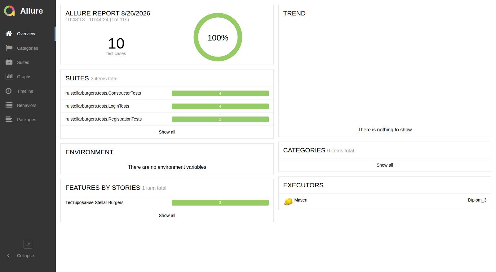

# Stellar Burgers — UI-автотесты

[](https://github.com/TatyanaKovalewa/stellar-burgers-ui-autotests/actions/workflows/tests.yml)
[](https://openjdk.org/projects/jdk/11/)
[](https://www.selenium.dev/)
[](https://tatyanakovalewa.github.io/stellar-burgers-ui-autotests/)

**10 UI-тестов, все проходят.** Прогоняются в CI в headless-Chrome при каждом пуше, Allure-отчёт публикуется автоматически:

**👉 [Открыть Allure-отчёт](https://tatyanakovalewa.github.io/stellar-burgers-ui-autotests/)**

[](https://tatyanakovalewa.github.io/stellar-burgers-ui-autotests/)

---

Проект автоматизации тестирования веб-приложения **Stellar Burgers** - сервиса доставки бургеров. Реализованы UI-тесты на Java с использованием Selenium WebDriver.

---

## 📋 Описание проекта

Проект содержит автоматизированные тесты для проверки функциональности:
- Регистрация нового пользователя
- Авторизация пользователя
- Переключение разделов в конструкторе бургеров

### Структура проекта
- **API слой**: `UserApiClient.java` - клиент для взаимодействия с API
- **Page Object**: страницы приложения (`HomePage`, `LoginPage`, `RegisterPage` и др.)
- **Step-классы**: бизнес-логика тестов (`HomeSteps`, `LoginSteps` и др.)
- **Тесты**: JUnit-тесты с Allure-аннотациями
- **Утилиты**: генерация тестовых данных
- **Модели данных**: DTO-объекты с использованием **Lombok** для сокращения шаблонного кода

---

## 🛠 Технологии

| Технология | Версия | Назначение |
|------------|--------|------------|
| Java | 11 | Язык программирования |
| JUnit | 4.13.2 | Фреймворк для тестирования |
| Selenium WebDriver | 4.15.0 | Автоматизация браузера |
| Rest Assured | 5.3.0 | API-тестирование |
| Allure | 2.15.0 | Отчетность по тестам |
| Maven | 3.9.0 | Сборка проекта |
| WebDriverManager | 5.6.2 | Управление драйверами браузеров |
| Lombok | 1.18.30 | Генерация кода (геттеры, сеттеры, конструкторы, билдеры) |
| Jackson | (встроен в Rest Assured) | Сериализация/десериализация JSON |

### Сериализация моделей
Для работы с API используются DTO-модели с аннотациями Lombok:
- `@Data` - генерирует геттеры, сеттеры, `toString()`, `equals()` и `hashCode()`
- `@Builder` - паттерн Builder для удобного создания объектов
- `@NoArgsConstructor` / `@AllArgsConstructor` - конструкторы для Jackson
- `@JsonInclude(JsonInclude.Include.NON_NULL)` - исключает null-поля из JSON

---

## 🔧 Настройка окружения

### Требования

- Установленная Java 11 или выше
- Установленный Maven 3.9.0+
- Браузер Chrome или Яндекс.Браузер

---

## Настройка браузера

По умолчанию тесты запускаются в **Chrome**, драйвер подтягивает WebDriverManager — настраивать ничего не нужно.

Для запуска без окна браузера (CI, машина без графической оболочки) добавьте `-Dheadless=true`.

Для **Яндекс.Браузера** пути к браузеру и драйверу передаются параметрами — в коде они не зашиты, поэтому проект не привязан к конкретной машине:

| Параметр | Назначение |
|----------|------------|
| `-Dbrowser=yandex` | выбрать Яндекс.Браузер |
| `-Dyandex.browser.path` | путь к `browser.exe` |
| `-Dyandex.driver.path` | путь к `chromedriver.exe` подходящей версии |

Пример команды — в разделе «Запуск тестов» ниже.

---

## 🚀 Запуск тестов

### Запуск тестов в Chrome

```bash
mvn test -Dbrowser=chrome -Dallure.results.directory=target/allure-results-chrome
```

### Запуск без окна браузера (headless)

Нужен для прогона в CI и на машине без графической оболочки:

```bash
mvn test -Dheadless=true
```

### Запуск тестов в Яндекс.Браузере

Пути к браузеру и драйверу задаются снаружи — проект не привязан к конкретной машине:

```bash
mvn test -Dbrowser=yandex \
  -Dyandex.driver.path="C:\\путь\\к\\chromedriver.exe" \
  -Dyandex.browser.path="C:\\путь\\к\\browser.exe" \
  -Dallure.results.directory=target/allure-results-yandex
```

---

## 📊 Allure отчетность

### Генерация отчета для Chrome

```bash
mvn allure:report -Dallure.results.directory=allure-results-chrome -Dallure.report.directory=target/site/chrome-report
```

### Генерация отчета для Яндекс.Браузера

```bash
mvn allure:report -Dallure.results.directory=allure-results-yandex -Dallure.report.directory=target/site/yandex-report
```

### Быстрый просмотр отчета

```bash
# Для Chrome
mvn allure:serve -Dallure.results.directory=target/allure-results-chrome

# Для Яндекс.Браузера
mvn allure:serve -Dallure.results.directory=target/allure-results-yandex
```

### Структура отчетов

После выполнения команд отчеты будут доступны:

- ✅ Chrome отчет: target/site/chrome-report/index.html

- ✅ Яндекс.Браузер отчет: target/site/yandex-report/index.html

---

## 📁 Структура пакетов

```
ru.stellarburgers/
├── api/              # API-клиенты
│   └── UserApiClient.java
├── models/           # DTO-модели данных (с Lombok)
│   └── UserModel.java
├── pages/            # Page Object модели
│   ├── BasePage.java
│   ├── HomePage.java
│   ├── LoginPage.java
│   ├── RegisterPage.java
│   └── ForgotPasswordPage.java
├── steps/            # Шаги тестов
│   ├── HomeSteps.java
│   ├── LoginSteps.java
│   ├── RegisterSteps.java
│   ├── ConstructorSteps.java
│   └── ForgotPasswordSteps.java
├── tests/            # Тестовые классы
│   ├── BaseTest.java
│   ├── LoginTests.java
│   ├── RegistrationTests.java
│   └── ConstructorTests.java
└── utils/            # Вспомогательные классы
    └── TestDataGenerator.java
```
    
---

## 🧪 Тестовые сценарии

### 1. Авторизация

- ✅ Вход через кнопку "Войти в аккаунт" на главной
- ✅ Вход через кнопку "Личный кабинет"
- ✅ Вход через кнопку на странице регистрации
- ✅ Вход через кнопку на странице восстановления пароля

### 2. Регистрация

- ✅ Успешная регистрация с валидными данными
- ✅ Ошибка при регистрации с паролем менее 6 символов

### 3. Конструктор

- ✅ Переключение между разделами "Булки", "Соусы", "Начинки"
- ✅ Последовательное переключение между всеми разделами

---

## 📝 Примечания

- ✅ API-тесты используют реальную БД, поэтому после каждого теста пользователь удаляется
- ✅ Уникальные данные генерируются для каждого теста с помощью TestDataGenerator
- ✅ Все тесты используют паттерн Page Object Model для повышения поддерживаемости
- ✅ Для сериализации/десериализации JSON используются аннотации Jackson и Lombok
- ✅ Отчеты для разных браузеров сохраняются в отдельные директории для удобства сравнения
- ✅ Класс UserModel использует @JsonInclude(Include.NON_NULL) для исключения null-полей в JSON-запросах
